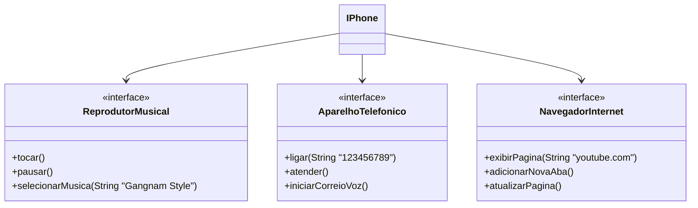

Desafio para exercitar os de POO e UML aprendidos na trilha "Programação Orientado a Objetos com Java" do bootcamp Santander 2024 - Backend com Java

Saiba mais em: [https://github.com/digitalinnovationone/trilha-java-basico/tree/main/desafios/sintaxe](https://github.com/digitalinnovationone/trilha-java-basico/blob/main/desafios/poo/README.md)

